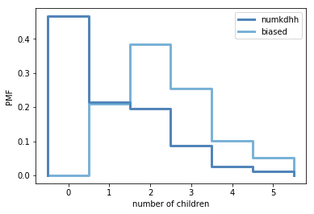

[Think Stats Chapter 3 Exercise 1](http://greenteapress.com/thinkstats2/html/thinkstats2004.html#toc31) (actual vs. biased)

The actual mean is 1.024 children per family, while the biased mean is 2.404.
```
pmf = thinkstats2.Pmf(resp.numkdhh, label = 'actual')
print('actual mean:', pmf.Mean())
actual mean: 1.024205155043831
```
```
biased_pmf = BiasPmf(pmf, label='biased')
print('biased mean:', biased_pmf.Mean())
biased mean: 2.403679100664282
```

