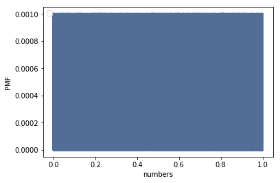
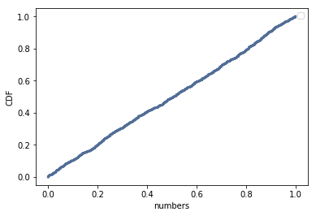

[Think Stats Chapter 4 Exercise 2](http://greenteapress.com/thinkstats2/html/thinkstats2005.html#toc41) (a random distribution)

The distribution is uniform.
```
one_thousand_numbers = np.random.random(1000)
```
```
pmf = thinkstats2.Pmf(one_thousand_numbers)
thinkplot.Pmf(pmf)
thinkplot.Show(xlabel='numbers', ylabel='PMF')
```

```
cdf = thinkstats2.Cdf(one_thousand_numbers)
thinkplot.Cdf(cdf)
thinkplot.Show(xlabel='numbers',ylabel='PMF')
```

